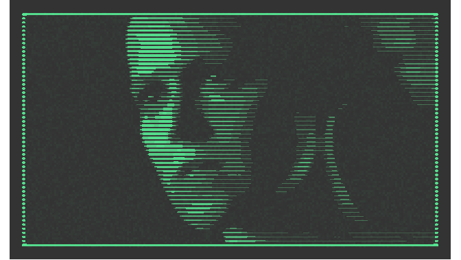

<!-- README.md is generated from README.Rmd. Please edit that file -->

# alien3-scan-line-aesthetic

### Intro

I watched Alien 3 last night (for the first time in years) and I was
reminded of how much I love the film’s aesthetic feel. From the brutal,
cavernous, liminal spaces, to the desolate, isolated nature of the
story.

Near the beginning, there is a scene where Ripley is found in the escape
pod and a pseudo-futuristic computer image of her is displayed. The
image is made from really coarse scan lines of bright green/blue on a
dark background. As I watched the film, I coded this attempt at trying
to recreate that image style. It’s not perfect and it’s really slow.

### Setup

``` r
library(tidyverse)
library(magick)
library(sf)
```

-   Define some parameters
    -   Horizontal image resolution
    -   Number of shades in image
    -   Factor for number of scan lines in image (multiplied by image
        height)
    -   Scan line buffer to define their thickness
    -   Range of transparency for noise
    -   Foreground and background colours

``` r
image_res <- 200
ncols <- 12
scan_lines_prop <- 0.5
scan_line_buffer_f <- 0.6
noise_range <- c(0, 0.05)
col_fg <- "seagreen1"
col_bg <- "grey20"
```

### Read image

-   Read image
-   Resize and add a border

``` r
i <- 
  image_read('https://www.looper.com/img/gallery/why-alien-3-almost-never-got-released/intro-1632832833.jpg') %>%
  image_resize(as.character(image_res-2)) %>% 
  image_border("white", paste0(1, "x", 1))

i
```


-   Compute image width and height
-   Compute number of scan lines and their positions
-   Compute the buffer size applied to the scan lines

``` r
i_inf <- image_info(i)
h <- i_inf$height
w <- i_inf$width

n_scan_lines <- h*scan_lines_prop
scan_lines <- seq(1+0.5, h-0.5, l=n_scan_lines)
scan_buffer <- (h/n_scan_lines/2)*scan_line_buffer_f
```

### Process image

-   Reduce colours and convert to dataframe
-   Compute the pixel intensities

``` r
i_df <-
  i %>%
  image_convert(type = "grayscale") %>%
  image_despeckle(3) %>% 
  image_flip() %>%
  image_quantize(max = ncols, dither=FALSE, treedepth = 0) %>%
  image_raster() %>%
  mutate(col = col2rgb(col) %>% t() %>% magrittr::extract(,1),
         col = scales::rescale(col, to=c(0, 1), from=c(0, 255)))
```

-   Create simple features polygon image

``` r
img_sf <-
  i_df %>% 
  stars::st_as_stars() %>%
  st_as_sf(as_points = FALSE, merge = TRUE) %>%
  st_make_valid() %>%
  st_set_agr("constant")
```

### Final image

-   Compute intersection of scan lines and image polygons
-   Buffer scan lines and plot
-   Add noise layer

``` r
tibble(l = scan_lines) %>% 
  mutate(ls = map(l, ~st_linestring(matrix(c(1, .x, w, .x), nrow=2, ncol=2, byrow = TRUE)))) %>%
  st_as_sf() %>%  
  st_set_agr("constant") %>% 
  st_intersection(img_sf) %>% 
  mutate(b = scales::rescale(col, to=c(0, scan_buffer))) %>% 
  mutate(ls = st_buffer(ls, b)) %>%
  arrange(col) %>%
  ggplot()+
  geom_sf(aes(fill = col), col=NA)+
  geom_raster(data = i_df %>% mutate(noise = runif(nrow(.))),
              aes(x, y, fill=noise, alpha=noise))+
  scale_fill_gradient(low=col_bg, high=col_fg)+
  scale_alpha_continuous(range = noise_range)+
  scale_x_continuous(expand = expansion(add = w*0.03))+
  scale_y_continuous(expand = expansion(add = w*0.03))+
  theme_void()+
  theme(panel.background = element_rect(fill = col_bg, colour = NA),
        legend.position = "")
```

<!-- -->

-   Save pdf

``` r
ggsave(filename = 'out.pdf', width = 10, height = 10, bg=col_bg)
```
